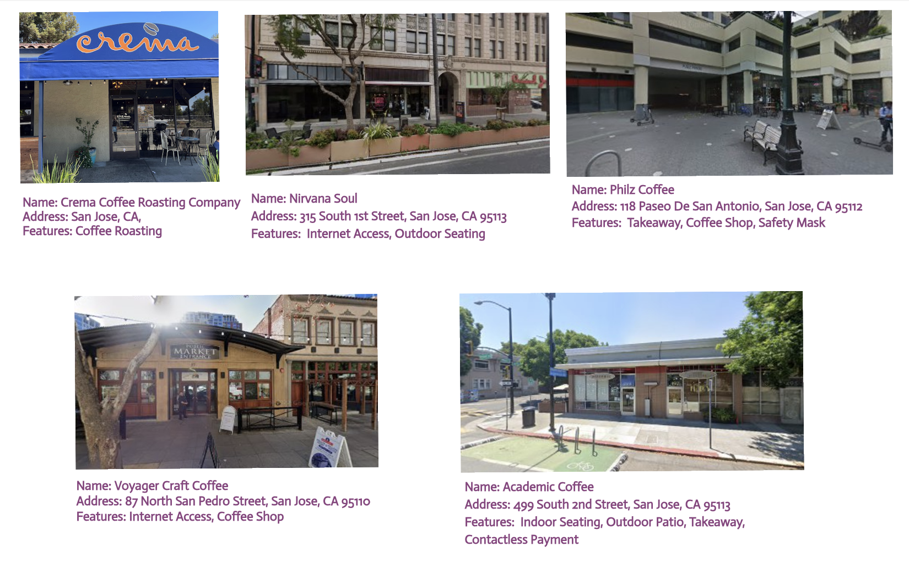

# coffeecompass - Use case using SuperAgentX

SuperAgentX - A Lightweight Modular Autonomous True Multi Agent AI Framework.


# CoffeeCompass

CoffeeCompass is a versatile coffee shop discovery tool built with SuperagentX framework. Find nearby cafes with detailed information about amenities, opening hours, and features.

## Features

- Search coffee shops by location or coordinates
- Get detailed shop information (amenities, hours, features)
- Multiple interfaces:
  - Interactive CLI
  - REST API
  - WebSocket Server
  - Pipe Interface

## Project Structure
```
coffeecompass/
├── handler/
│   └── coffeecompass_handler.py
├── pipe.py
├── iopipe.py
├── restpipe.py
├── wspipe.py
└── config.py
```

## Installation

```bash
# Install required packages
pip install superagentx aiohttp fastapi rich websockets certifi

# Clone the repository
git clone https://github.com/yourusername/coffeecompass.git
cd coffeecompass
```

## Usage

### CLI Interface
```bash
python iopipe.py
```

## Cafes 


## Output
```json
[
  {
    "name": "Crema Coffee Roasting Company",
    "address": "San Jose, CA",
    "features": [
      "coffee_roasting"
    ]
  },
  {
    "name": "Nirvana Soul",
    "address": "315 South 1st Street, San Jose, CA 95113",
    "features": [
      "internet_access",
      "outdoor_seating",
      "opening_hours"
    ]
  },
  {
    "name": "Philz Coffee",
    "address": "118 Paseo De San Antonio, San Jose, CA 95112",
    "features": [
      "takeaway",
      "coffee_shop",
      "safety_mask"
    ]
  },
  {
    "name": "Voyager Craft Coffee",
    "address": "87 North San Pedro Street, San Jose, CA 95110",
    "features": [
      "internet_access",
      "coffee_shop"
    ]
  },
  {
    "name": "Academic Coffee",
    "address": "499 South 2nd Street, San Jose, CA 95113",
    "features": [
      "indoor_seating",
      "outdoor_patio",
      "takeaway",
      "contactless_payment"
    ]
  }
]
```

### REST API Server
```bash
# Development mode
fastapi dev restpipe.py

# Production mode
fastapi run restpipe.py
```

### WebSocket Server
```bash
python wspipe.py
```

## API Examples

### REST API
```python
import requests

response = requests.get(
    'http://localhost:8000/search',
    params={'query': 'coffee shops in chennai'},
    headers={'api-token': 'your-auth-token'}
)
```

### WebSocket Client
```python
import websockets

async with websockets.connect(
    'ws://localhost:8765?token=your-auth-token'
) as websocket:
    await websocket.send('coffee shops in bangalore')
    response = await websocket.recv()
```

## Configuration

Set your authentication token in `config.py`:
```python
AUTH_TOKEN = 'your-secret-token'
```

## Dependencies

- SuperagentX Framework
- aiohttp
- FastAPI
- Rich (for CLI interface)
- WebSockets
- Certifi

## License

MIT License

## Contributing

1. Fork the repository
2. Create a feature branch
3. Commit changes
4. Push to the branch
5. Open a Pull Request

 

