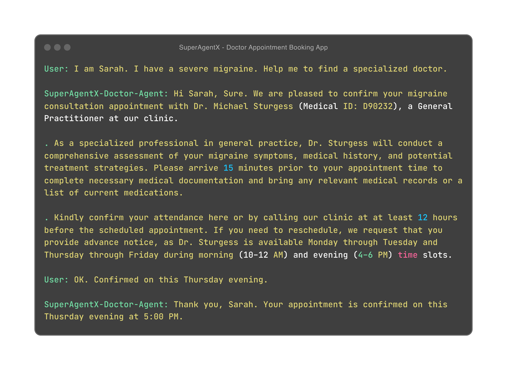

# doctor appointment - Use case using SuperAgentX

SuperAgentX - A Lightweight Modular Autonomous True Multi Agent AI Framework.

# Doctor Appointment Booking App - Using SuperAgentX
The doctor appointment booking app is an application built using SuperAgentX framework. This user-friendly smart app helps outpatients identify the best-specialized doctor and book an appointment with the doctor simultaneously.
This interactive app allows users to ask questions in natural language, and it responds by providing information about the doctor's availability.

## Application Architecture

## Demo
