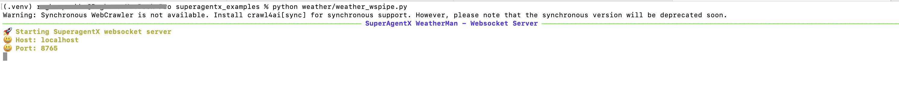

# SuperAgentX - WeatherMan

## Introduction
This project is an example using the SuperAgentX framework to get real-time weather for the given city / place.


### Weather Teller - Multi Agent with Sequential Mode.

The Below example explains how to invoke Bedrock Converse API using the SuperAgentX framework.
In this example, the SuperAgentX Agent module can automatically invoke weather handler (Tool). This function can be fully operational by integrating any weather service API. 
Later in the example, we connect to the Open-Meteo API.

1. Agent 1 (`lat_and_long_agent`) : Get Latitude & Longitude for the given place / city.
2. Agent 2 (`weather_agent_agent`) : Get real-time weather for the given city's latitude & longitude.


Although this example leverages Claude 3 Sonnet, Bedrock supports many other models. The full list of models and supported features can be found [here](https://docs.aws.amazon.com/bedrock/latest/userguide/conversation-inference.html). The models are invoked via `bedrock-runtime`.


**Best Practice**: Always set your AWS credentials as environment variables.

```
export AWS_ACCESS_KEY=<<`YOUR_ACCESS_KEY`>>
export AWS_SECRET_KEY=<<`YOUR_ACCESS_SECRET_KEY`>>
export AWS_REGION=<<`AWS_REGION`>>
```

#### LLM Config in SuperAgentX

LLM Configuration Specify ==> llm_config

| Name       | Description                                                                                                      | Data Type | Required | Example                                              |
|:-----------|:-----------------------------------------------------------------------------------------------------------------|:----------|:---------|:-----------------------------------------------------|
| `model`    | AWS Bedrock supported [models](https://docs.aws.amazon.com/bedrock/latest/userguide/conversation-inference.html) | str       | Yes      | 'model': 'anthropic.claude-3-5-sonnet-20240620-v1:0' |
| `llm_type` | LLM type - `bedrock`                                                                                             | str       | Yes      | 'llm_type':'bedrock'                                 |


```python
llm_config = {'model': 'anthropic.claude-3-5-sonnet-20241022-v2:0', 'llm_type':'bedrock'}
llm_client: LLMClient = LLMClient(llm_config=llm_config)

```

#### Setup

```shell
git clone git@github.com:superagentxai/superagentX-examples.git
```

```shell
cd superagentX-examples/superagentx_examples
```
```shell
python -m venv .venv
```
```shell
source .venv/bin/activate
```
```shell
pip install poetry
```
```shell
poetry install
```


Note: 

1. For AWS Bedrock - Ensure `AWS_REGION`, `AWS_ACCESS_KEY` & `AWS_SECRET_KEY` Keys are set in environment!
2. For OpenAI -  `OPENAI_API_KEY` set in environment.

---------------------------------------
#### 1. WeatherMan - IO Console Pipe
```shell
python weather/weather_iopipe.py
```

##### IO Console Output


---------------------------------------

#### 2. WeatherMan - Websocket Pipe
```shell
python weather/weather_wspipe.py
```

##### Websocket Output



---------------------------------------

#### 3. WeatherMan - RESTFul API (FastAPI) Pipe
```shell
fastapi run weather/weather_fastapi.py
```
##### Websocket Output


_Query_ : New zealand Weather?

```shell
curl --location 'http://127.0.0.1:8000/search?query=newzeland%20weather?'
```

```json
[
    {
        "name": "Latitude Longitude Agent",
        "agent_id": "d836c5ebf0504bc89824455f4664f6ae",
        "reason": "The output context provides the latitude and longitude coordinates for New Zealand (specifically Wellington, its capital), which directly satisfies the goal of getting coordinates for the given place.",
        "result": {
            "latitude": "-41.2887953",
            "longitude": "174.7772114"
        },
        "content": null,
        "error": null,
        "is_goal_satisfied": true
    },
    {
        "name": "Weather Man Agent",
        "agent_id": "d836c5ebf0504bc89824455f4664f6ae",
        "reason": "The output context contains real-time weather data for New Zealand including temperature, wind speed, direction, and weather code based on the provided coordinates (latitude: -41.5000831, longitude: 172.8344077)",
        "result": {
            "temperature": "14.9°C",
            "windspeed": "38.4 km/h",
            "winddirection": "321°",
            "weathercode": 3,
            "time": "2024-11-01T06:15",
            "is_day": 1
        },
        "content": null,
        "error": null,
        "is_goal_satisfied": true
    }
]
```
